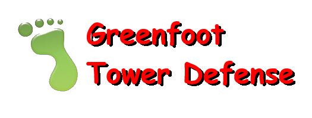

---
## Greenfoot Tower Defense

#### Autoři: Ondřej Tomašťík, Marek Reich, Oliver Šesták

---
*Programovací projekt I. ročníku, Obchodní akademie Uherské Hradiště*
***

**Motto**: "Stavte obranné věže a ubráníte naši pevnost!"

**Téma**: Hra se odehrává v moderním světě, kde hráč brání svou pevnost před útoky nepřátelských sil. Jednotlivé prvky reprezentují různé typy obranných věží, které hráč může stavět, a nepřátelské jednotky, které se snaží prolomit obranu.

**Úkol hráče**: Hráč musí postavit a strategicky umístit obranné věže tak, aby zastavil postup nepřátelských sil a zabránil jim v průniku do pevnosti.

### Aktéři:

**Hráč:** Ovládá stavbu a umístění obranných věží.

**Nepřátelské jednotky:** Různé typy nepřátelských jednotek, každá s vlastními schopnostmi a zranitelnostmi.

#### Ovládání hry:
Hráč bude hru ovládat pomocí myši nebo dotykového rozhraní, kde klikáním na herní plochu umisťuje a upravuje obranné věže.

**Pravidla pohybu aktérů:**

Nepřátelské jednotky se objevují na určených místech na mapě a postupují směrem k pevnosti hráče.
Každá jednotka má svou vlastní trasu pohybu, kterou musí dodržovat.
Nepřátelské jednotky se pohybují určitou rychlostí a mají různou odolnost vůči útokům.

#### Cíl hry: 
Hra končí, když hráč úspěšně ubrání pevnost a nepřátelské jednotky jsou zničeny nebo odraženy. Výsledek hráče se vyhodnotí na základě toho, kolik vln nepřátel hráč zastavil a kolik poškození pevnosti utrpěl.
